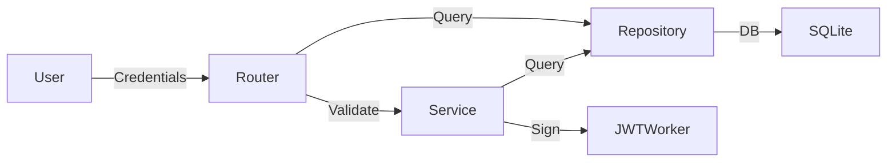

# Ejemplo de Documentación de Módulo (Auth)

Este es un ejemplo de cómo queda un módulo tras el paso del **Guardian**.

## 🏗️ Arquitectura de Autenticación

## 🛠️ Responsabilidades

- Emisión y validación de tokens JWT.
- Encriptación de contraseñas mediante Argon2.
- Gestión de sesiones persistentes en Redis.

## 🔒 Seguridad (Gobernanza)

- **Constraint**: Nunca devolver el hash de la contraseña en la respuesta de la API.
- **Constraint**: Los tokens deben expirar en 15 minutos (Regla SEC-004).

---
*Cerrado por el Guardian: Sincronizado con el grafo v2.4.*
