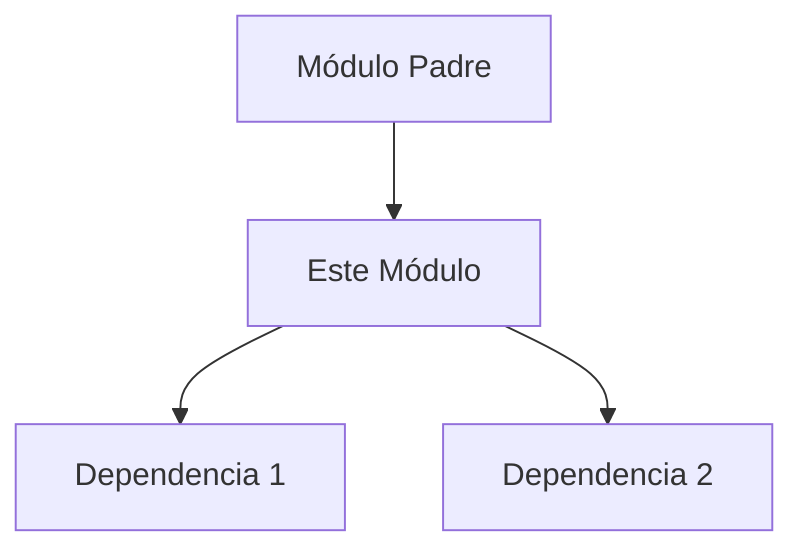

# 📦 Módulo: [Nombre del Módulo]

> [Resumen de una línea sobre la responsabilidad única del módulo]

## 🏗️ Arquitectura del Módulo

## 🛠️ Responsabilidades

- [Responsabilidad 1]
- [Responsabilidad 2]

## 🔒 Restricciones de Seguridad e Integridad

- **Regla 1**: [Ej: No llamar directamente a la base de datos, usar repositorio.]
- **Regla 2**: [Ej: Datos sensibles deben ser enmascarados antes de loguear.]

## 🚦 Flujo de Operación

1. [Paso 1 del proceso principal]
2. [Paso 2 del proceso principal]

## 🧪 Cómo Testear

- **Unit Tests**: `pytest tests/modules/[nombre]`
- **Coverage Target**: 80%

---
*Documentado por Documentation Guardian.*
