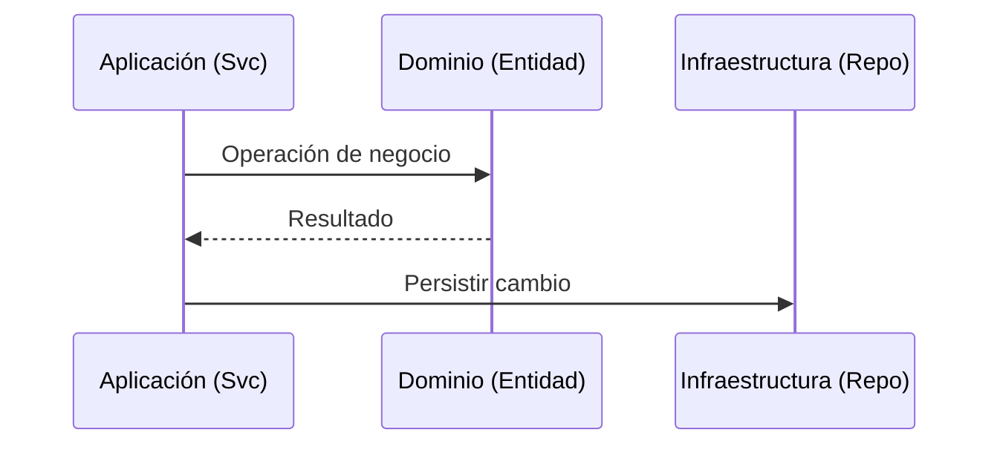

# ⚙️ Capa de Aplicación: [Nombre del Módulo]

> **Elite Rule**: Aquí residen los Casos de Uso. Esta capa orquesta el dominio pero no conoce la infraestructura.

## 🏃 Casos de Uso

- **[Caso de Uso 1]**: [Flujo de pasos]
- **[Caso de Uso 2]**: [Flujo de pasos]

## 🔌 Puertos (Interfaces)

Esta capa define cómo se comunica con el exterior mediante abstracciones:

- **[IRepository]**: Definición para persistencia.
- **[IExternalService]**: Definición para integraciones.

## 🚦 Orquestación

---
*Capa de orquestación (Casos de Uso).*
